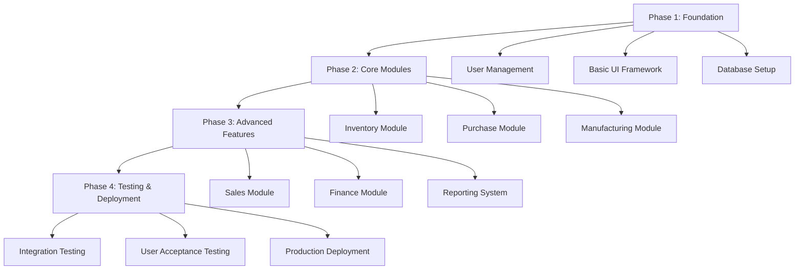

# ERP Shoe Production System - Product Requirements Document (PRD)

## 1. Introduction

### 1.1 System Overview
The ERP Shoe Production System is a comprehensive web-based application designed to manage all aspects of shoe manufacturing operations. The system integrates inventory management, purchasing, manufacturing processes, sales, and financial tracking to streamline operations for a shoe production facility.

### 1.2 Objectives
- Automate and integrate all business processes in shoe production
- Provide real-time visibility into inventory, production, and financial data
- Improve efficiency in production planning and execution
- Enable data-driven decision making through comprehensive reporting
- Ensure traceability of materials and products throughout the production cycle

### 1.3 Scope
The system will include five main modules:
- Inventory Management
- Purchase Management
- Manufacturing Management
- Sales Management
- Finance Management

## 2. Features and Modules

### 2.1 Inventory Module
- **Production Inventory**: Track finished shoe products by type, size, color, and quantity
- **Raw Material Inventory**: Monitor raw materials used in production (leather, soles, threads, etc.)
- **Stock Alerts**: Automatic notifications for low stock levels
- **Inventory Adjustments**: Manual adjustments for damaged goods or discrepancies
- **Location Tracking**: Track inventory across different warehouse locations

### 2.2 Purchase Module
- **Raw Material Procurement**: Create and manage purchase orders for raw materials
- **Vendor Management**: Maintain vendor database with contact information and performance history
- **Finished Shoe Procurement**: Purchase completed shoes from external vendors
- **Purchase Order Tracking**: Monitor order status from creation to delivery
- **Supplier Performance**: Track delivery times, quality, and pricing history

### 2.3 Manufacturing Module
- **Production Orders (PO)**: Create production plans specifying shoe types, quantities, and timelines
- **Bill of Materials (BOM)**: Define material requirements for each shoe type
- **Manufacturing Process**: Track production through 4 stages:
  - Gurat (Cutting)
  - Assembly
  - Press
  - Finishing
- **Work Orders (SPK)**: Generate work instructions for each production stage with required materials and quantities
- **Production Tracking**: Real-time monitoring of work-in-progress and completion status

### 2.4 Sales Module
- **Order Management**: Process customer orders for finished shoes
- **Customer Management**: Maintain customer database and order history
- **Pricing Management**: Set and manage product pricing
- **Order Fulfillment**: Track order status from receipt to delivery
- **Sales Reporting**: Generate sales reports and analytics

### 2.5 Finance Module
- **Income Tracking**: Record all sales revenue and other income sources
- **Expense Tracking**: Log all operational expenses (materials, labor, overhead)
- **Financial Reporting**: Generate profit/loss statements, balance sheets, and cash flow reports
- **Budget Management**: Set and monitor departmental budgets
- **Audit Trail**: Maintain complete financial transaction history

## 3. User Roles and Permissions

### 3.1 Administrator
- Full system access
- User management
- System configuration
- All reporting capabilities

### 3.2 Production Manager
- Access to Manufacturing and Inventory modules
- Create and approve production orders
- Monitor production progress
- View production reports

### 3.3 Purchase Manager
- Access to Purchase and Inventory modules
- Create purchase orders
- Manage vendor relationships
- Approve supplier payments

### 3.4 Sales Manager
- Access to Sales and Inventory modules
- Manage customer orders
- Set pricing
- View sales reports

### 3.5 Finance Manager
- Access to Finance module
- Generate financial reports
- Manage budgets
- Approve financial transactions

### 3.6 Warehouse Staff
- Limited Inventory module access
- Update stock levels
- Process incoming/outgoing shipments

## 4. Technical Requirements

### 4.1 Technology Stack
- **Backend**: Django (Python web framework)
- **Database**: PostgreSQL
- **Frontend**: Django Templates with Bootstrap/CSS
- **Authentication**: Django's built-in authentication system
- **Deployment**: Docker containers for easy deployment

### 4.2 System Requirements
- **Hardware**: Standard web server requirements
- **Software**: Python 3.8+, PostgreSQL 12+
- **Browser Support**: Modern browsers (Chrome, Firefox, Safari, Edge)

### 4.3 Performance Requirements
- Support up to 100 concurrent users
- Response time < 2 seconds for standard operations
- 99.9% uptime requirement

### 4.4 Security Requirements
- User authentication and authorization
- Data encryption for sensitive information
- Audit logging for all transactions
- Role-based access control

## 5. Development Phases

The development will be divided into 4 main phases:

### Phase 1: Foundation
- Set up Django project structure
- Implement user authentication and role management
- Create basic UI templates and navigation
- Configure database models and relationships

### Phase 2: Core Modules
- Develop Inventory Management module
- Implement Purchase Management module
- Build Manufacturing Management module with PO, BOM, and SPK functionality

### Phase 3: Advanced Features
- Implement Sales Management module
- Develop Finance Management module
- Create comprehensive reporting and analytics

### Phase 4: Testing & Deployment
- Perform integration testing across all modules
- Conduct user acceptance testing
- Deploy to production environment
- Provide user training and documentation

## 6. Success Criteria

- All modules functional and integrated
- System handles production workflow from raw material purchase to finished product sale
- Real-time inventory and production tracking
- Comprehensive financial reporting
- User-friendly interface for all role types
- System performance meets requirements
- Successful user training and adoption

## 7. Risks and Mitigation

- **Data Migration**: Ensure proper data import from existing systems
- **User Adoption**: Provide comprehensive training and support
- **Integration Issues**: Thorough testing of module interactions
- **Performance**: Optimize database queries and implement caching where needed

## 8. Future Enhancements

- Mobile application for field workers
- Advanced analytics and AI-powered forecasting
- Integration with external systems (accounting software, e-commerce platforms)
- Barcode/QR code scanning for inventory management